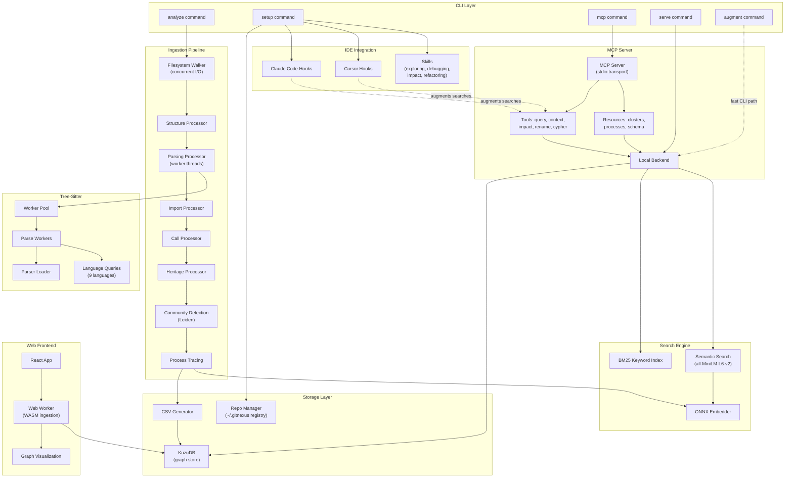

# GitNexus Architecture

> Auto-generated from the GitNexus knowledge graph (1021 symbols, 2552 edges, 79 execution flows).

## Overview

GitNexus is a graph-powered code intelligence platform that indexes codebases into a knowledge graph and exposes them via MCP (Model Context Protocol) tools for AI agents. It consists of three packages:

- **`gitnexus/`** — Core CLI + MCP server (published to npm). Indexes repositories, stores graphs in KuzuDB, and serves queries.
- **`gitnexus-web/`** — Browser-based frontend with WebAssembly tree-sitter and in-browser KuzuDB.
- **`gitnexus-claude-plugin/`** / **`gitnexus-cursor-integration/`** — IDE integrations that augment AI agent tool calls with graph context.

## Functional Areas

The codebase is organized into 14 functional clusters detected by community analysis:

| Module | Symbols | Cohesion | Responsibility |
|--------|---------|----------|----------------|
| **Ingestion** | 108 | 24% | Multi-phase pipeline: file walking, tree-sitter parsing, import resolution, call tracing, heritage extraction, community detection, process tracing |
| **Kuzu** | 50 | 23% | KuzuDB graph storage adapter, CSV generation, schema management, query execution |
| **Embeddings** | 46 | 35% | Embedding pipeline: text generation from symbols, ONNX model inference, vector storage |
| **Components** | 41 | 35% | Web UI React components (graph visualization, search, navigation) |
| **Local** | 38 | 15% | MCP backend: tool implementations (query, context, impact, rename), resource handlers, search (BM25 + semantic) |
| **Workers** | 38 | 27% | Web Workers for browser-side ingestion and tree-sitter parsing; Node.js worker threads for parallel parsing |
| **LLM** | 28 | 37% | LLM-based cluster enrichment, prompt building, provider abstraction |
| **CLI** | 24 | 35% | Command handlers (analyze, setup, serve, mcp), AI context file generation, IDE hook/skill installation |
| **Storage** | 22 | 32% | Repository registry, `.gitnexus/` directory management, staleness detection |
| **Services** | 14 | 31% | Shared services (config, ignore patterns, language support) |
| **Hooks** | 12 | 56% | Claude Code / Cursor hook scripts for augmenting search tools with graph context |
| **Search** | 11 | 36% | Hybrid search: BM25 keyword index + semantic vector search with reciprocal rank fusion |

## Key Execution Flows

### 1. CLI Analyze Pipeline

The primary ingestion path when a user runs `npx gitnexus analyze`:

```
analyzeCommand (cli/analyze.ts)
  → runPipelineFromRepo (ingestion/pipeline.ts)
    → walkRepository          — concurrent file I/O (32 parallel reads)
    → processStructure        — folder/file graph nodes
    → processParsing          — tree-sitter AST parsing (worker threads)
    → processImports          — import/require/use resolution
    → processCalls            — function call tracing with confidence
    → processHeritage         — extends/implements relationships
    → processCommunities      — Leiden community detection
    → processProcesses        — execution flow tracing
  → loadGraphToKuzu           — CSV export → KuzuDB bulk import
  → runEmbeddingPipeline      — generate + store symbol embeddings
  → generateAIContextFiles    — write CLAUDE.md, AGENTS.md, skills
```

### 2. MCP Server Request Flow

When an AI agent calls a GitNexus MCP tool:

```
mcpCommand (cli/mcp.ts)
  → startMCPServer (mcp/server.ts)
    → callTool (mcp/local/local-backend.ts)
      → ensureInitialized     — lazy KuzuDB connection + embedder init
      → query/context/impact  — graph traversal via KuzuDB Cypher
      → semanticSearch        — ONNX embedding + vector similarity
    → readResource (mcp/resources.ts)
      → queryClusters/queryProcesses — direct graph queries
```

### 3. Graph Storage Pipeline

```
loadGraphToKuzu (kuzu/kuzu-adapter.ts)
  → generateAllCSVs (kuzu/csv-generator.ts)
    → generateFileCSV         — node CSVs per label type
    → escapeCSVField          — UTF-8 sanitization
  → KuzuDB COPY FROM          — bulk CSV import
  → createIndexes             — property indexes for query performance
```

### 4. Embedding Pipeline

```
runEmbeddingPipeline (embeddings/embedding-pipeline.ts)
  → generateBatchEmbeddingTexts (embeddings/text-generator.ts)
    → generateEmbeddingText   — symbol → natural language description
    → generateFunctionText    — include signature, calls, file context
    → cleanContent            — strip noise, truncate
  → embedBatch                — ONNX Runtime inference (all-MiniLM-L6-v2)
  → storeEmbeddings           — KuzuDB vector storage
```

### 5. Web App Pipeline (Browser)

```
AppStateProvider (hooks/useAppState.tsx)
  → runPipeline (workers/ingestion.worker.ts)   — Web Worker
    → runPipelineFromFiles (ingestion/pipeline.ts)
      → createKnowledgeGraph
      → processParsing        — WASM tree-sitter
      → processImports/Calls/Heritage
      → processCommunities/Processes
  → loadGraphToKuzu           — in-browser KuzuDB (WASM)
```

## Architecture Diagram



## Data Flow Summary

```
Source Code
    │
    ▼
┌─────────────────────────────────────────┐
│  Ingestion Pipeline (8 phases)          │
│  Files → AST → Symbols → Relationships │
│  → Communities → Execution Flows        │
└─────────────────┬───────────────────────┘
                  │
          ┌───────┴───────┐
          ▼               ▼
    ┌──────────┐   ┌────────────┐
    │  KuzuDB  │   │ Embeddings │
    │  (graph) │   │ (vectors)  │
    └────┬─────┘   └─────┬──────┘
         │               │
         └───────┬───────┘
                 ▼
         ┌──────────────┐
         │  MCP Server  │
         │  (7 tools)   │
         └──────┬───────┘
                │
    ┌───────────┼───────────┐
    ▼           ▼           ▼
 Claude      Cursor      Other
  Code      Editor     MCP Clients
```

## Supported Languages

Tree-sitter grammars are included for: **TypeScript**, **JavaScript**, **Python**, **Java**, **C**, **C++**, **C#**, **Go**, **Rust**.

## Key Design Decisions

1. **Augmentation over replacement** — Hooks enrich existing AI agent tools (Grep, Glob, Bash) with graph context rather than replacing them
2. **Native tree-sitter** — Uses N-API bindings (not WASM) in the CLI for performance; WASM in the browser
3. **Worker thread parsing** — CPU-bound tree-sitter parsing parallelized across `cpus - 1` worker threads
4. **Hybrid search** — BM25 keyword + semantic vector search combined with Reciprocal Rank Fusion for ranking
5. **LRU AST cache** — Parsed trees are cached across pipeline phases to avoid redundant re-parsing
6. **Deterministic IDs** — `generateId(label, qualifiedName)` ensures idempotent graph construction
