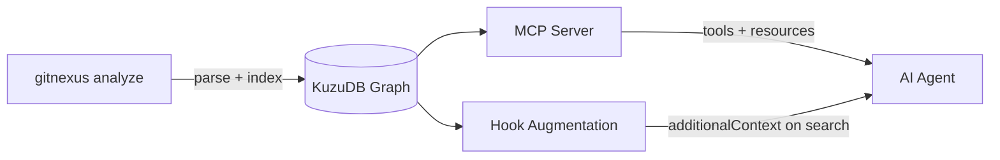
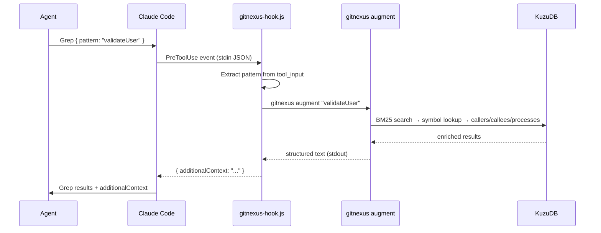
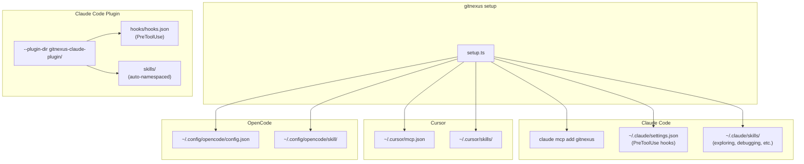

# GitNexus: Architecture & Approach

GitNexus is a code intelligence layer that builds a knowledge graph from your repository's structure — functions, classes, call relationships, execution flows — and delivers that context to AI coding agents through two complementary channels: **MCP tools** for explicit deep dives and **hook-based augmentation** that invisibly enriches every search the agent performs.

## Architecture



`gitnexus analyze` walks the repository, extracts symbols and relationships using tree-sitter, detects communities with the Leiden algorithm, traces execution flows into processes, and stores everything in a KuzuDB graph database under `.gitnexus/kuzu/`.

The graph is then queryable through two paths:

1. **MCP tools** — the agent calls `query`, `context`, `impact`, etc. explicitly when it needs structural understanding.
2. **Hook augmentation** — a PreToolUse hook fires on every Grep/Glob/Bash search, runs a fast BM25 lookup against the graph, and injects related symbols, callers, callees, and execution flows as `additionalContext`. The agent never asks for this; it just appears alongside search results.

## The Graph

```mermaid
erDiagram
    File ||--o{ Function : DEFINES
    File ||--o{ Class : DEFINES
    File ||--o{ Interface : DEFINES
    Class ||--o{ Method : DEFINES
    Function ||--o{ Function : CALLS
    Method ||--o{ Function : CALLS
    Function ||--o{ File : IMPORTS
    Class ||--o{ Class : EXTENDS
    Class ||--o{ Interface : IMPLEMENTS
    Function }o--|| Community : MEMBER_OF
    Function }o--|| Process : STEP_IN_PROCESS
```

**Nodes** represent code symbols: `File`, `Folder`, `Function`, `Class`, `Interface`, `Method`, `CodeElement`. Language-specific nodes include `Struct`, `Enum`, `Trait`, `Impl`, etc.

**Edges** use a single `CodeRelation` table with a `type` property:
- `CALLS` — function/method invocation
- `IMPORTS` — file/module import
- `EXTENDS` / `IMPLEMENTS` — inheritance
- `DEFINES` / `CONTAINS` — structural containment
- `MEMBER_OF` — community membership
- `STEP_IN_PROCESS` — participation in an execution flow (with `step` order)

**Communities** are auto-detected functional areas (Leiden algorithm). Each community has a `heuristicLabel` (e.g., "Authentication", "Database") and a `cohesion` score measuring internal connectivity density. Same-label communities are aggregated for display; clusters with fewer than 5 symbols are filtered out.

**Processes** are execution flow traces — ordered sequences of symbols that represent a call chain from entry point to terminal. Each process has a `heuristicLabel`, `processType`, and `stepCount`. A single symbol can participate in multiple processes.

## MCP Tools

| Tool | Purpose |
|------|---------|
| `list_repos` | Discover indexed repositories and their stats |
| `query` | Search for execution flows related to a concept (hybrid BM25 + semantic, grouped by process) |
| `context` | 360-degree view of a single symbol — callers, callees, imports, process participation |
| `impact` | Blast radius analysis — what breaks if you change a symbol, grouped by depth |
| `detect_changes` | Map uncommitted git changes to affected symbols and execution flows |
| `rename` | Multi-file coordinated rename using graph refs + text search fallback |
| `cypher` | Raw Cypher queries against the knowledge graph |

### query

Returns results grouped by process (execution flow), not by file. Hybrid search combines BM25 keyword matching with semantic vector search, merged via Reciprocal Rank Fusion.

```json
{
  "processes": [
    { "summary": "UserAuthentication", "priority": 0.033, "symbol_count": 4, "process_type": "request_handler", "step_count": 7 }
  ],
  "process_symbols": [
    { "name": "validateUser", "type": "Function", "filePath": "src/auth/validator.ts", "startLine": 15, "step_index": 3 }
  ],
  "definitions": [
    { "name": "AuthConfig", "type": "Interface", "filePath": "src/auth/types.ts" }
  ]
}
```

### context

Categorized 360-degree view with disambiguation for common names.

```json
{
  "status": "found",
  "symbol": { "uid": "Function:src/auth/validator.ts:validateUser", "name": "validateUser", "kind": "Function", "filePath": "src/auth/validator.ts", "startLine": 15, "endLine": 42 },
  "incoming": {
    "calls": [
      { "uid": "Function:src/routes/login.ts:handleLogin", "name": "handleLogin", "filePath": "src/routes/login.ts" }
    ],
    "imports": [
      { "uid": "File:src/routes/login.ts", "name": "login.ts", "filePath": "src/routes/login.ts" }
    ]
  },
  "outgoing": {
    "calls": [
      { "uid": "Function:src/db/users.ts:findByEmail", "name": "findByEmail", "filePath": "src/db/users.ts" }
    ]
  },
  "processes": [
    { "id": "proc_auth_login", "name": "UserAuthentication", "step_index": 3, "step_count": 7 }
  ]
}
```

### impact

Blast radius grouped by depth: d=1 will break, d=2 likely affected, d=3 may need testing.

```json
{
  "target": { "name": "validateUser", "type": "Function", "filePath": "src/auth/validator.ts" },
  "direction": "upstream",
  "impactedCount": 5,
  "byDepth": {
    "1": [{ "name": "handleLogin", "type": "Function", "filePath": "src/routes/login.ts", "relationType": "CALLS", "confidence": 1.0 }],
    "2": [{ "name": "authRouter", "type": "Function", "filePath": "src/routes/index.ts", "relationType": "CALLS", "confidence": 1.0 }]
  }
}
```

### detect_changes

Maps git diff to indexed symbols and traces which execution flows are impacted.

```json
{
  "summary": { "changed_count": 3, "affected_count": 2, "changed_files": 1, "risk_level": "medium" },
  "changed_symbols": [
    { "name": "validateUser", "type": "Function", "filePath": "src/auth/validator.ts", "change_type": "Modified" }
  ],
  "affected_processes": [
    { "name": "UserAuthentication", "process_type": "request_handler", "step_count": 7, "changed_steps": [{ "symbol": "validateUser", "step": 3 }] }
  ]
}
```

### rename

Graph-based rename with text search fallback. Edits tagged by confidence source.

```json
{
  "status": "success",
  "old_name": "validateUser",
  "new_name": "verifyUser",
  "files_affected": 4,
  "total_edits": 7,
  "graph_edits": 5,
  "text_search_edits": 2,
  "changes": [
    { "file_path": "src/auth/validator.ts", "edits": [{ "line": 15, "old_text": "function validateUser(", "new_text": "function verifyUser(", "confidence": "graph" }] },
    { "file_path": "src/tests/auth.test.ts", "edits": [{ "line": 8, "old_text": "validateUser(testInput)", "new_text": "verifyUser(testInput)", "confidence": "text_search" }] }
  ],
  "applied": false
}
```

## Hook Augmentation

The hook intercepts every search the agent runs and silently enriches it with graph context. The agent doesn't request this — it just sees richer results.

### Flow



### What the hook receives

```json
{
  "hook_event_name": "PreToolUse",
  "tool_name": "Grep",
  "tool_input": { "pattern": "validateUser", "path": "src/" },
  "cwd": "/home/user/project"
}
```

### What the hook returns

```json
{
  "hookSpecificOutput": {
    "hookEventName": "PreToolUse",
    "additionalContext": "[GitNexus] 3 related symbols found:\n\nvalidateUser (src/auth/validator.ts)\n  Called by: handleLogin, authMiddleware\n  Calls: findByEmail, hashPassword\n  Flows: UserAuthentication (step 3/7)\n\nauthMiddleware (src/middleware/auth.ts)\n  Called by: router.use\n  Calls: validateUser, getSession\n  Flows: RequestPipeline (step 2/5)"
  }
}
```

### Before and after

**Without augmentation** — the agent sees only grep matches:

```
src/auth/validator.ts:15: export function validateUser(email: string, password: string) {
src/routes/login.ts:23:   const user = await validateUser(req.body.email, req.body.password);
src/tests/auth.test.ts:8:   const result = validateUser("test@example.com", "password123");
```

**With augmentation** — the same grep results arrive with additional context appended:

```
src/auth/validator.ts:15: export function validateUser(email: string, password: string) {
src/routes/login.ts:23:   const user = await validateUser(req.body.email, req.body.password);
src/tests/auth.test.ts:8:   const result = validateUser("test@example.com", "password123");

[GitNexus] 3 related symbols found:

validateUser (src/auth/validator.ts)
  Called by: handleLogin, authMiddleware
  Calls: findByEmail, hashPassword
  Flows: UserAuthentication (step 3/7)

authMiddleware (src/middleware/auth.ts)
  Called by: router.use
  Calls: validateUser, getSession
  Flows: RequestPipeline (step 2/5)

handleLogin (src/routes/login.ts)
  Called by: authRouter
  Calls: validateUser, createSession
  Flows: UserAuthentication (step 4/7)
```

The agent now knows the call chain, related symbols it hasn't searched for yet, and which execution flows are involved — without making any explicit tool call.

### Pattern extraction

The hook extracts search patterns from different tool types:
- **Grep** → uses `pattern` directly
- **Glob** → extracts meaningful name segments from glob patterns
- **Bash** → detects `rg`/`grep` commands and extracts the pattern argument, skipping flags

Patterns shorter than 3 characters are ignored. If no `.gitnexus` index exists in the working directory ancestry, the hook exits silently.

## Internal Ranking

### Clusters as a hidden signal

Communities (clusters) detected by the Leiden algorithm have a `cohesion` score measuring internal connectivity density. This score is used **exclusively as an internal ranking signal** — it is never exposed in tool output or augmentation text.

In `query`, cluster cohesion provides a subtle ranking boost:
```
priority = aggregate_rrf_score + (cohesion * 0.1)
```

In augmentation, results are sorted by their cluster cohesion before formatting. The effect: symbols from tightly-connected functional areas rank higher, but the agent never sees "cluster" or "cohesion" anywhere — it just gets better-ordered results.

### Processes as result grouping

Processes serve as the primary grouping mechanism for `query` results. Instead of returning a flat list of symbol matches, results are organized by execution flow:

1. Hybrid search finds matching symbols
2. Each symbol is traced to its process(es) via `STEP_IN_PROCESS` edges
3. Processes are ranked by aggregate relevance score (with cohesion boost)
4. Results arrive grouped: "here are the execution flows related to your query, with the symbols in each"

Symbols not belonging to any process fall into a `definitions` bucket (types, interfaces, standalone declarations).

## Platform Integration



**Two install paths for Claude Code:**

1. **`gitnexus setup`** — copies hook scripts to `~/.claude/hooks/gitnexus/`, merges PreToolUse config into `~/.claude/settings.json`, installs skills to `~/.claude/skills/`. Works globally across all projects.

2. **Plugin mode** (`claude --plugin-dir gitnexus-claude-plugin/`) — self-contained directory with `hooks/hooks.json` and skills. Uses `${CLAUDE_PLUGIN_ROOT}` env var for script paths. Skills are auto-namespaced (e.g., `/gitnexus:exploring`).

Both paths install the same 4 skills: `exploring`, `debugging`, `impact-analysis`, `refactoring`.

**Cursor** gets MCP config at `~/.cursor/mcp.json` and skills at `~/.cursor/skills/`.

**OpenCode** gets MCP config at `~/.config/opencode/config.json` and skills at `~/.config/opencode/skill/`.

All MCP entries point to the same server: `npx -y gitnexus@latest mcp`.

## UX Perspective

From the agent's point of view, GitNexus operates on two levels:

**Invisible enrichment** — Every search the agent runs (grep for a function name, glob for a file pattern, bash with ripgrep) gets silently augmented. The agent sees its normal search results plus a `[GitNexus]` block listing related symbols, their callers/callees, and which execution flows they participate in. This happens on every search without the agent doing anything special. The effect is that the agent naturally discovers related code it wouldn't have found from text search alone.

**Explicit tools for deep dives** — When the agent needs structural understanding (not just "find where X is used" but "what happens if I change X"), it uses the MCP tools directly:
- `query` to find execution flows related to a concept
- `context` to get the full picture of a specific symbol
- `impact` to assess blast radius before making changes
- `detect_changes` to understand what uncommitted work affects
- `rename` to safely rename across the codebase with graph-backed confidence

The invisible layer handles the 80% case (richer search context), while the explicit tools handle the 20% (deep structural questions). The agent doesn't need to decide when to use GitNexus for search enrichment — it just happens.
